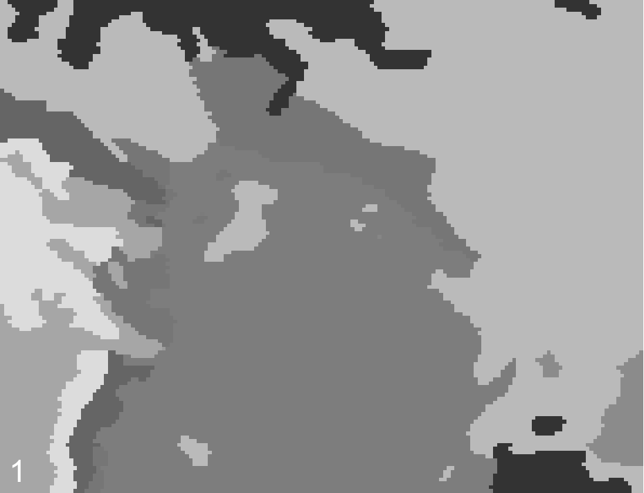

# High Quality Contours via GRASS

sample to create high quality contours via GRASS which is important for weather data

Inspired from a answer on StackOverflow http://gis.stackexchange.com/questions/87505/grass-v-generalize-method-douglas-not-working-as-expected




just a note:
```
gdal_contour Pressure_80_2017-02-16T13:00:00Z.tif -off 0 -i 500 press_500.shp
ogr2ogr -f GeoJSON -lco coordinate_precision=2 press_500_s.json press_500.shp
```