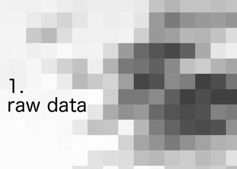

# High Quality Contours via GRASS

Sample environment and script to create high quality contours via GRASS and GDAL/OGR. Typical use cases are isobar maps for weather- and elevation maps

It is inspired by an answer on StackOverflow.  
http://gis.stackexchange.com/questions/87505/grass-v-generalize-method-douglas-not-working-as-expected

## environment

* GRASS GIS 7.2.0
* GDAL 2.1.2, released 2016/10/24

## build docker image

* `docker build -t grass .`

## run sample script

* `docker run -it --rm -v $(pwd):$(pwd) -w $(pwd) grass ./sample-script.sh`
* results in new file `sample-data/isolines.geojson` 

## references

* GRASS and Shell 
https://grasswiki.osgeo.org/wiki/GRASS_and_Shell

* GRASS Docker Images 
https://github.com/geo-data/grass-docker